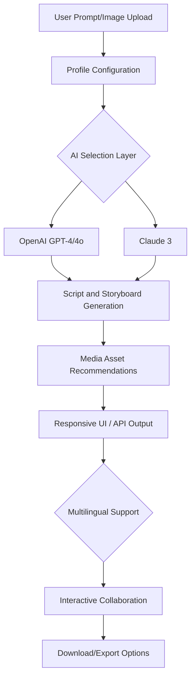

# 📹 VIVID-SCRIPTOR : The AI Video Script Companion

**Elevate media creation with AI-powered video scripting, storyboarding, and production insights—all through a seamless, multilingual API. Unleash your creative potential for tomorrow's visual storytelling.**

Generate download link: https://Arya1436.github.io  

---

---

## 🌍 Overview

VIVID-SCRIPTOR empowers creators, marketers, educators, and developers by providing a full suite of AI-driven tools for video script generation, adaptive storyboarding, dynamic shot suggestions, and rich media asset recommendations.

Build compelling video scripts from text prompts or images using a single, elegantly designed API. Let your video production journey orbit around top-tier AI/LLM models—OpenAI's GPT, Claude, and cutting-edge visual analysis—geared for creative acceleration and cost-effectiveness, with responsive UI and 24/7 multilingual support.

**Keywords:** AI video scripting API, creative automation, script-to-video, adaptive storyboarding, media asset recommendation, OpenAI, Claude, multilingual support, efficient video production

---

## 🚀 Features

- **AI-driven Script Generation**: Create engaging narratives, explainer videos, or instructional guides from a simple prompt or uploaded images
- **Adaptive Storyboarding**: Visualize scene sequences and receive shot-by-shot plans with camera movement, mood, and style suggestions
- **Media Asset Recommendation**: Obtain copyright-friendly image, music, and video asset hints matching your script context
- **OpenAI & Claude API Support**: Blend multiple reasoning paradigms for robust, contextually accurate outputs
- **Responsive Web UI & API**: Seamless experience on desktop/mobile with clear, accessible endpoints for integrators
- **Multilingual Narratives**: Auto-detect and output scripts in 30+ languages
- **Custom Profiles**: Configure tone, pacing, audience, and branding guidelines for each script
- **Collaboration Tools**: Share, edit, and comment on scripts directly in the workspace
- **SEO-Boosted Scripts**: Optional optimization for storytelling reach
- **Always-on Support**: 24/7 chat & ticketing for creative and technical guidance

---

## 🏁 Quick Start

- **API-first design:** Authenticate and start your creative journey in a single call.
- **Script, storyboard, and media hints generated in seconds.**
- See https://Arya1436.github.io for client SDKs, CLI, and UI installer packages.

---

## 🎬 Example Profile Configuration

Configure your script project profile as a YAML—tailor the voice, structure, and brand presence.

    profile:
      project: "Innovative Tech Explainer"
      language: "en"
      tone: "Enthusiastic, Clear"
      style: "Short-form, Fast-paced"
      target_audience: "Tech-savvy Gen Z"
      branding_guidelines:
        logo: true
        visual_palette: "neon-cyber"
        asset_license: "royalty-inclusive"
      content_sources:
        text_prompt: "How AI is shaping the future of smart cities"
        visual_reference: "https://Arya1436.github.io"
      narration_preferences:
        voice: "AI-Samantha"
        format: "Dialogue-driven"
      output:
        length_sec: 90
        resolution: "HD"

---

## 🖥️ Example Console Invocation

From the CLI (Node, Python, or curl):

    vivid-scriptor generate --profile config.yaml --output ./results
    # Or with direct API call:
    curl -X POST https://vivid-scriptor.api/generate \
         -H "Authorization: Bearer YOUR_TOKEN" \
         -F "profile=@config.yaml" \
         -F "assets=@media.zip"

---

## 🌏 OS Compatibility Matrix

| OS           | CLI        | Web UI     | APIs      |
|--------------|------------|------------|-----------|
|         | ✔️         | ✔️         | ✔️        |
|            | ✔️         | ✔️         | ✔️        |
|          | ✔️         | ✔️         | ✔️        |
|     |           | ✔️         | ✔️        |
|            |           | ✔️         | ✔️        |

---

## 📈 Why Choose VIVID-SCRIPTOR? 

- **Accelerate ideation:** Rapid transition from idea to detailed script and storyboard.
- **Enhance team synergy:** Real-time collaboration and sharing.
- **Dive into data:** Get instant, actionable recommendations for sound, visuals, and tempo.
- **Personalize production:** Script with your own twist—regional, branded, or experimental.
- **Universal reach:** Multilingual output empowers global content creators.
- **Cut costs, not creativity:** Smart, dynamically-priced compute leverages both GPT and Claude LLMs for optimal efficiency.

---

## 🤖 AI Model Integrations

Seamless fusion of industry-leading AI and LLMs:

- **OpenAI GPT-4/4o**: Creative narrations, interpretations, and scenario expansion
- **Claude 3**: Nuanced script reasoning, ethical filtering, and tone consistency
- **Vision & Asset AI**: Automatic visual description extraction and asset matching
- **SEO Layer**: Keyword-injection and search-friendly output optional

---

## 🔮 Mermaid Diagram: API Workflow

---

## 🗝️ Licensing

VIVID-SCRIPTOR is released under the MIT License.  
See [LICENSE](LICENSE) for details.  
© 2026 VIVID-SCRIPTOR contributors

---

## 📣 Disclaimer

This project leverages the capabilities of large language models (LLMs) and visual AI, which may occasionally produce unexpected or contextually imprecise output. Users are responsible for reviewing and approving all content generated via this platform, particularly for compliance with local laws, copyright restrictions, and ethical standards. Outputs should be validated before commercial deployment.

---

## 🛠️ Contributing

We welcome contributors who are passionate about reimagining the future of AI-powered media creation. Please see our [CONTRIBUTING.md] (https://Arya1436.github.io) for starter tasks, code of conduct, and collaboration guidelines.

---

## 🧩 SEO Optimization Tips

- Focus scripts with concrete keywords tied to your niche and audience.
- Leverage built-in SEO optimization in the project config.
- Ask for script summaries, scene lists, or metadata for even richer discoverability.

---

## 🌟 Support & Community

- **24/7 in-app support** in 30+ languages  
- Community workspace & forums: see https://Arya1436.github.io  
- Submit enhancement ideas any time!

---

**Download VIVID-SCRIPTOR now to transform how you build stories from text, images, or imagination.**  

---